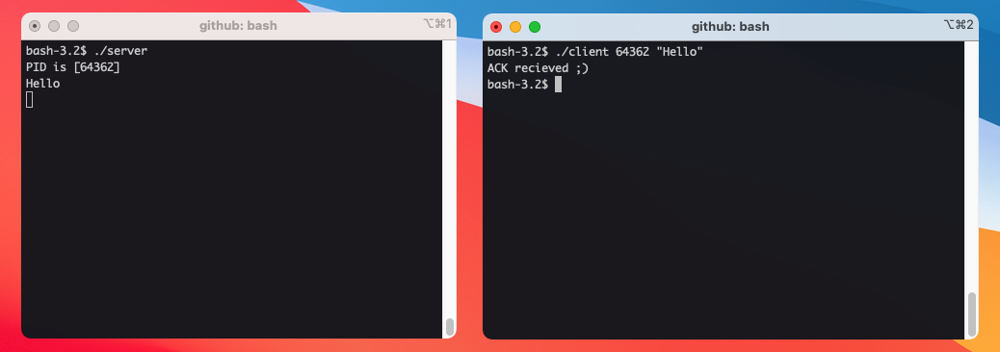

# Minitalk

このプロジェクトでは、シグナルを使用したプロセス間通信により、メッセージの送受信が出来るサーバー、クライアントプログラムを作成しました。

## 開発及び実行環境

MacOS

## 使い方

リポジトリをクローンし、コンパイルしてください。  
ターミナルを２つ立ち上げ、一方でサーバーを起動します。  
サーバーを起動するとPIDが表示されます。  
サーバーの起動後、クライアントにコマンドライン引数でサーバーのPIDとメッセージを渡します。  
サーバー側にメッセージが表示され、クライアント側にACKが表示されれば成功です。

```bash
# クローン
git clone https://github.com/TaiyouSekiguchi/minitalk.git
cd minitalk

# コンパイル
make
```

サーバー側ターミナル

```bash
./server 
# PID is [...] と表示されます
```

クライアント側ターミナル

```bash
./client "server_PID" "message"
# サーバー側にメッセージが表示され、クライアント側に "ACK received ;)" と表示されれば成功
```

## 実行例


